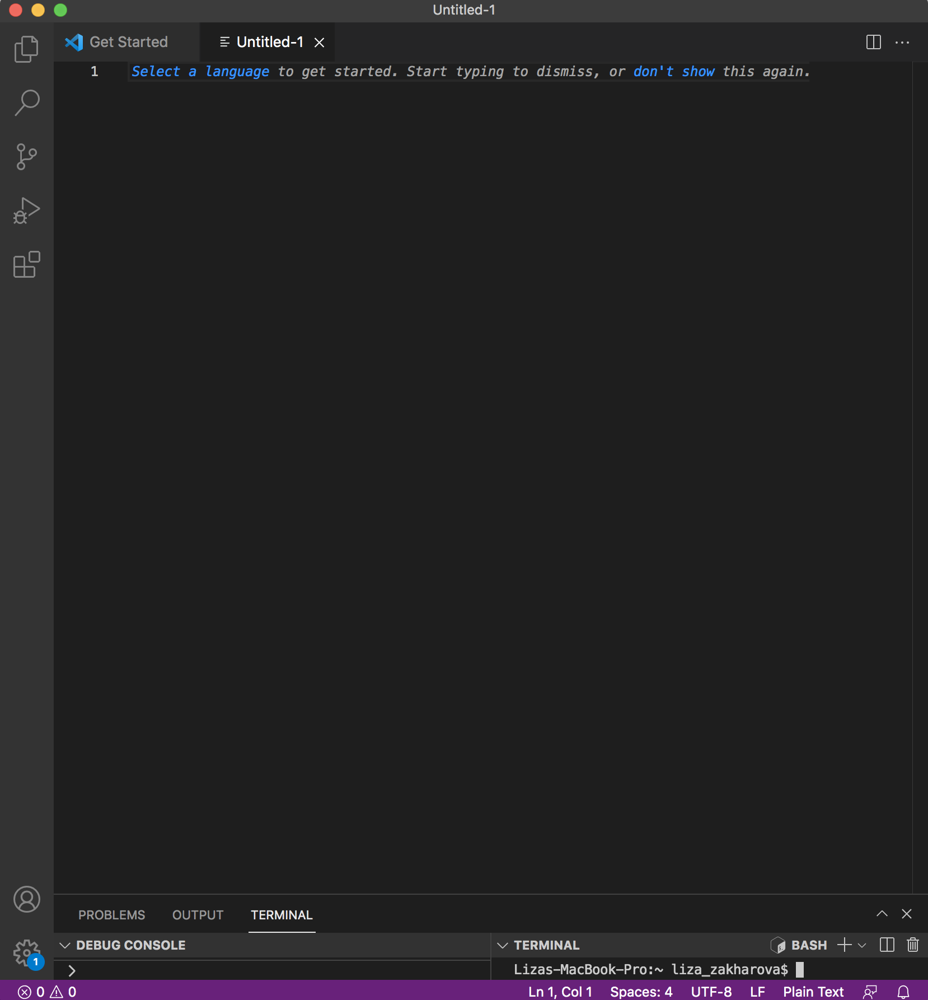
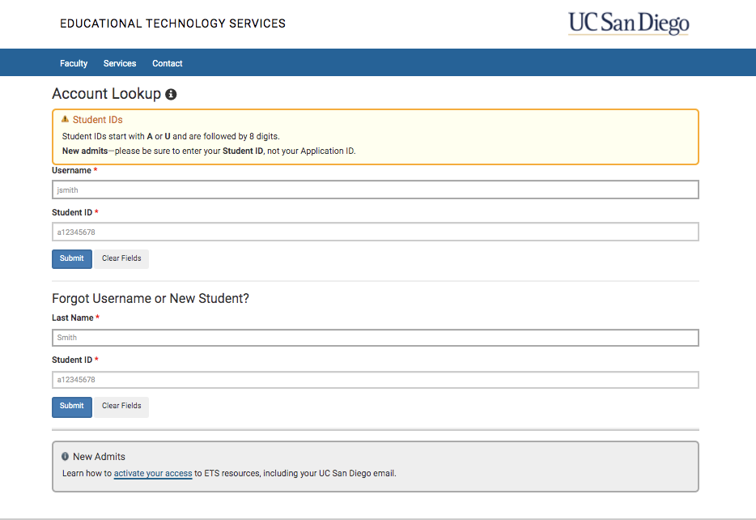
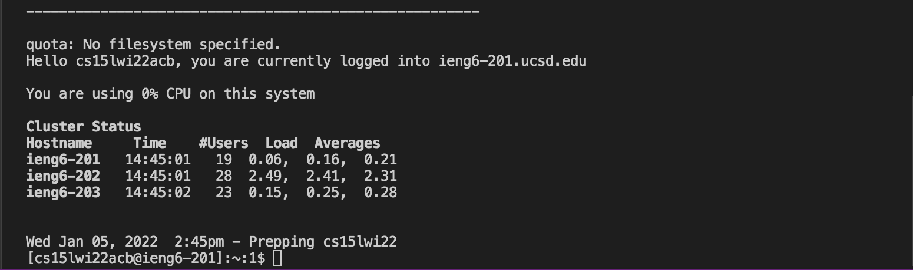
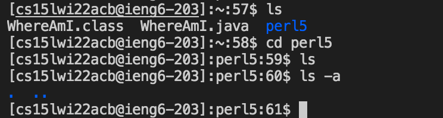
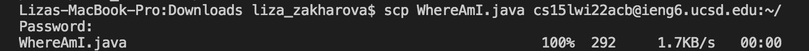
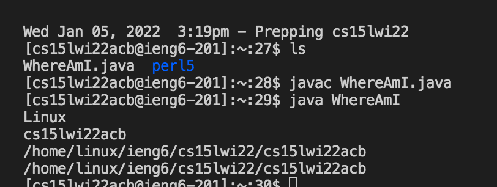
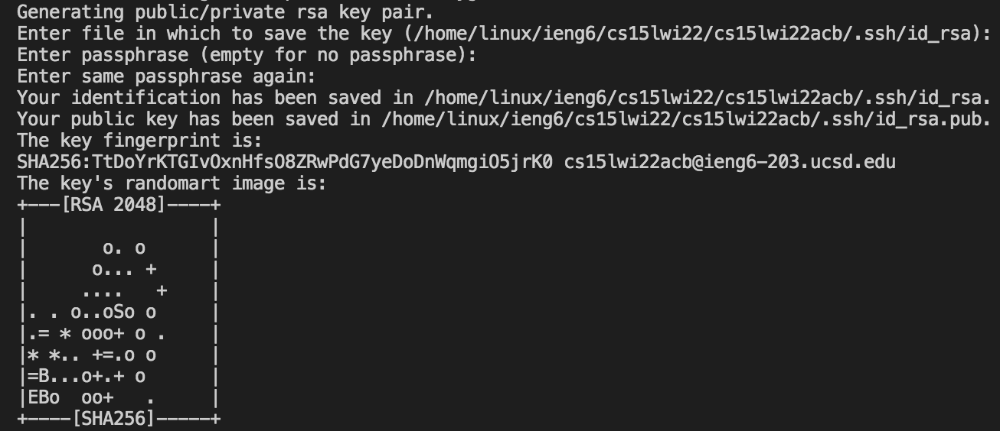
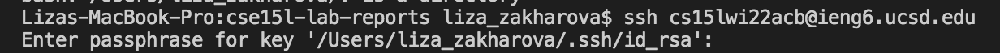
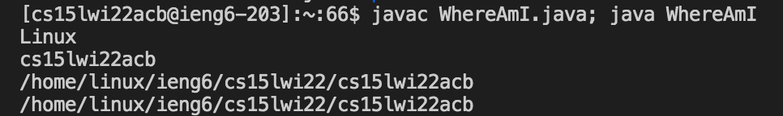

# Week 2 Lab Report - How To Use ieng6

Helpful Links: [Back to main page](index.html)

## Step 1: Installing VS Code
1. Go to the website [Visual Studio Homepage](https://code.visualstudio.com/) and download Visual Studio Code to your computer.
2. Open VS Code and try creating new file. Your screen should look like this:

## Step 2: Remotely Connecting
1. To connect to a remote server for your class, first open the terminal in VS code, click Terminal in the top bar and then click New Terminal. 

2. Type ssh + SPACE + the name of your course specific account so it looks like this: `` ssh *course-specific account*@ieng6.ucsd.edu ``.

Example: 

3. You should then be prompted for password. If yours is not working go to the website [UCSD Account Lookup](https://sdacs.ucsd.edu/~icc/index.php) (as shown in screenshot) and change the password for your course-specific account.

3. After you log-in using your password in the terminal you should see an output like this:

## Step 3: Trying Some Commands
1. In the remote server, type `` ls ``. This will provide a list of files in that directory (folder). Folders in the list will be highlighted blue.
2. Now try opening a folder by typing `` cd *folder name* ``. Type the `` ls `` command again.
3. Notice no files show up. Now type `` ls -a ``.The command -a reveals the hidden files in the folder. Your terminal should look like this:

4. To exit the remote server, click CTRL + D.

## Step 4: Moving Files with `` scp ``
1. In the terminal, write the command `` scp *filename* *account name*@ieng6.ucsd.edu:~./ ``, where the filename is an existing file on your computer.

2. You should be prompted to enter your password for the account. After you will get an output that looks like this:

3. Now, if you follow the `` ssh `` instrutions to log-in to your remote server, the file will now be in the main directory, and you can run it remotely using javac, java commands:

## Step 5: Setting an SSH Key
1. In your home directory terminal (not remote server), type `` ssh-keygen ``. Click ENTER once, then type a passphrase (something shorter than your password), then click ENTER again. Your terminal after typing the command should look like this:

2. Now copy the public key by typing the command `` scp /Users/liza_zakharova/.ssh/id_rsa.pub cs15lwi22acb@ieng6.ucsd.edu:~/.ssh/authorized_keys ``, but replace the username with your username and account with your course-specific account.

3. Now try logging in to your remote account. You should be prompted for your passphrase instead of a password:

## Step 6: Optimizing Remote Running
1. To optimize running, you can use the UP ARROW key to find/copy previous commands you've written.

2. To make running more efficient, you can use semi-colons to separate commands in the same line, like in the example below:

Thank you for reading through Liza Zakharova's Tutorial on how to use the terminal and remote server!