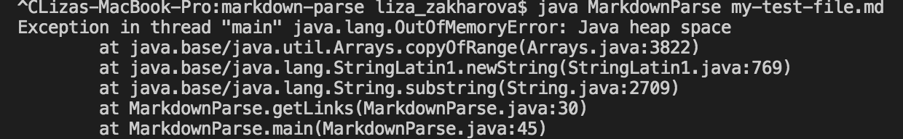

# Week 4 Lab Report - Finding and Fixing Bugs

[Back to main page](index.html)

Below are three bugs and corresponding code changes I made while working on the MarkdownParse.java file with my group:

## Change #1

2-3 description of relationship between bug, symptom, failure-inducing input. The link for the test file containing the failure inducing input that was causing the symptom is below, as well as the output due to the bug:

Link to page: [my-test-file.md](my-test-file.md)
Link to page on Github: [https://github.com/lizazak/markdown-parse/blob/main/my-test-file.md](https://github.com/lizazak/markdown-parse/blob/main/my-test-file.md)

Image of screenshot change in github

## Change #2

2-3 description of relationship between bug, symptom, failure-inducing input. The link for the test file containing the failure inducing input that was causing the symptom is below:

Link to test file

show screenshot of output of running file where failing (in VS code)

Image of screenshot change in github

## Change #3

2-3 description of relationship between bug, symptom, failure-inducing input. The link for the test file containing the failure inducing input that was causing the symptom is below:

Link to test file

show screenshot of output of running file where failing (in VS code)

Image of screenshot change in github