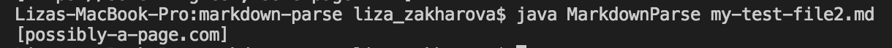
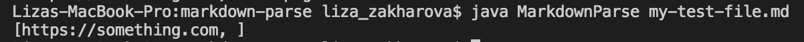

# Week 4 Lab Report - Finding and Fixing Bugs

[Back to main page](index.html)

**Below are three bugs and corresponding code changes I made while working on the MarkdownParse.java file with my group.**

## Change #1
 
#### Bug-Symptom-Input Relationship:

The failure-inducing output was a markdown file with an image, and it caused the symptom of printing the image link, even though it wasn't a webpage link. This symptom was caused by a bug in the method, where the method wasn't checking for exclamation marks that could identify if the link was an image.

#### The link for the test file containing the failure-inducing input that was causing the symptom is below, as well as the output due to the bug:

Link to page on Github: [https://github.com/lizazak/markdown-parse/blob/main/my-test-file2.md](https://github.com/lizazak/markdown-parse/blob/main/my-test-file2.md)

#### Below is the code change difference that fixed the bug:

## Change #2

#### Bug-Symptom-Input Relationship:

The failure-inducing output was a markdown file with two typical links. Because of the change I made in change 1 to fix the image issue, the method now didn't work for this regular file. The symptom was it only outputed the first link, not the second one. The bug turned out to be that in line 23 of MarkdownParse.java, the openParen index was being searched for starting at the variable index, so it identified the same openParen as for the first link, and as a result, didn't pass the if-statement in lines 25-30, not allowing it to print out the 2nd link.

#### The link for the test file containing the failure-inducing input that was causing the symptom is below, as well as the output due to the bug:

Link to page on Github: [https://github.com/lizazak/markdown-parse/blob/main/test-file.md](https://github.com/lizazak/markdown-parse/blob/main/test-file.md)

#### Below is the code change difference that fixed the bug:

## Change #3

#### Bug-Symptom-Input Relationship:

The failure-inducing output was a file where there was a declared link but there was no actual link in the parentheses. This caused a symptom where the output list contained an empty element. The bug in the method was that there was no code accounting for if the parentheses are empty, therefore empty strings were being printed when they shouldn't be.

#### The link for the test file containing the failure-inducing input that was causing the symptom is below, as well as the output due to the bug:

Link to page on Github: [https://github.com/lizazak/markdown-parse/blob/main/my-test-file.md](https://github.com/lizazak/markdown-parse/blob/main/my-test-file.md)

#### Below is the code change difference that fixed the bug:

**Thanks for taking a look at some bugs I had and how I fixed them!**