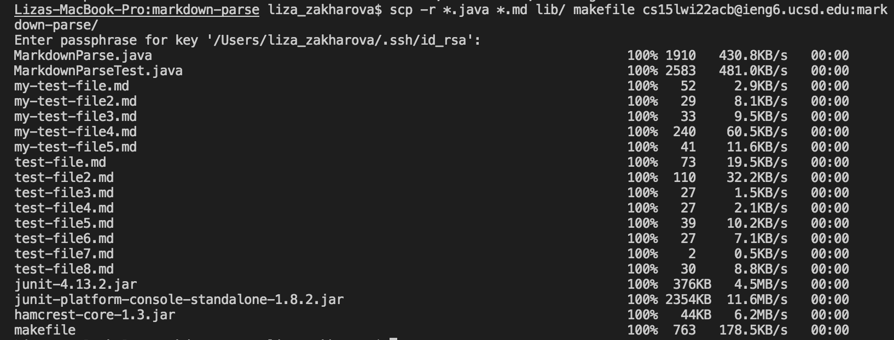
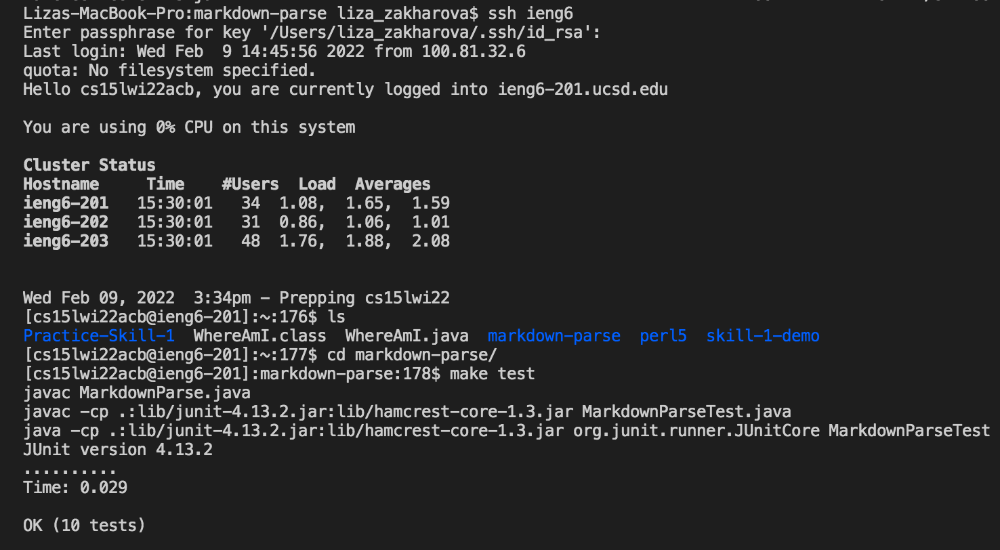
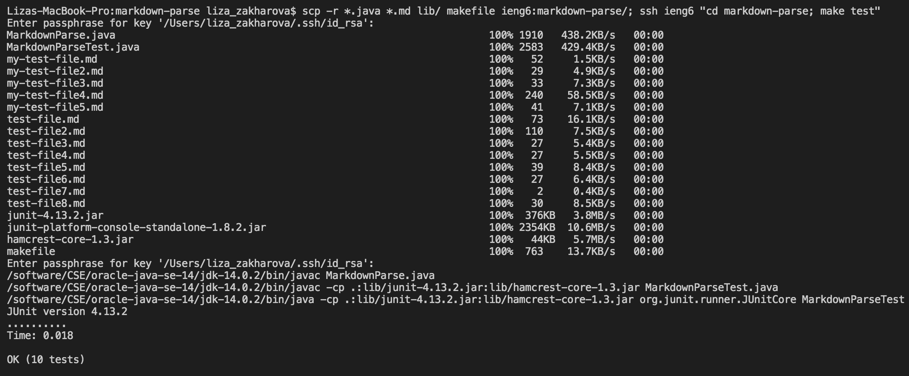

# Week 6 Lab Report - How To Copy Whole Directories

[Back to main page](index.html)

### Copying the markdown-parse directory to the ieng6 account:

Command to copy: ``scp -r *.java *.md lib/ makefile ieng6:markdown-parse/``

### Logging on to ieng6 account and compiling/running tests

Logging in to the ieng6 account (directory should be on the server):

Compiling and running tests:

### Copying and Running the Tests in One Line

Command to run in one line: ``scp -r *.java *.md lib/ makefile ieng6:markdown-parse/; ssh ieng6 "cd markdown-parse; make test"``

