# Week 8 Lab Report - Running and Analyzing Tests for MarkdownParse

[Back to main page](index.html)

## Link to my markdown-parse directory:

[https://github.com/lizazak/markdown-parse](https://github.com/lizazak/markdown-parse)

### Snippet 1 Test Details

Expected Output:

`[google.com, ucsd.edu]`

How I turned it into a test:

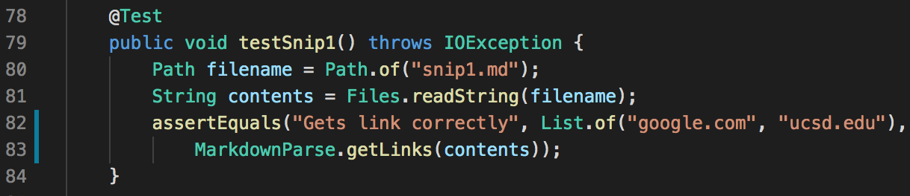

**Test did NOT pass**
Test failure in the JUnit output:

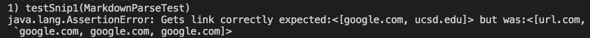

Fail including stack trace:

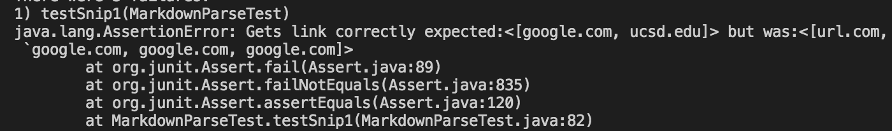

### Snippet 2 Test Details

Expected Output:

`[a.com, example.com]`

How I turned it into a test:

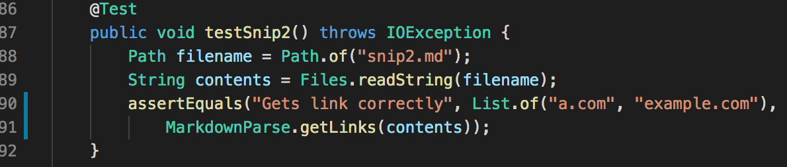

**Test did NOT pass**
Test failure in the JUnit output:

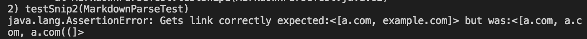

Fail including stack trace:

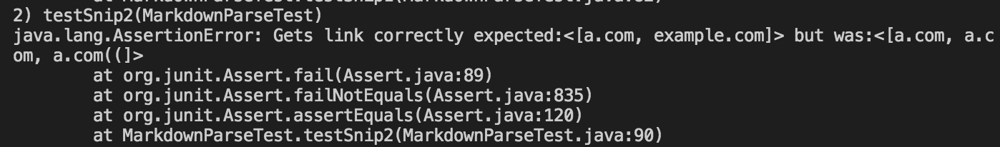

### Snippet 3 Test Details

Expected Output:

`[https://ucsd-cse15l-w22.github.io/, https://cse.ucsd.edu/]`

How I turned it into a test:

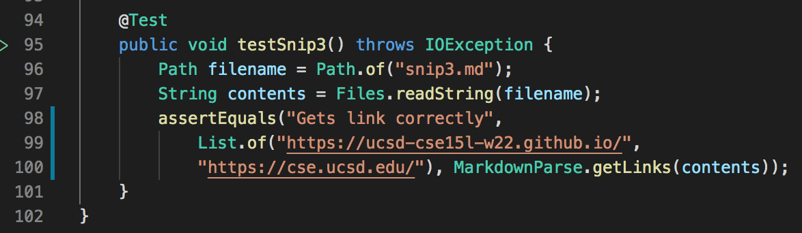

**Test did NOT pass**
Test failure in the JUnit output:

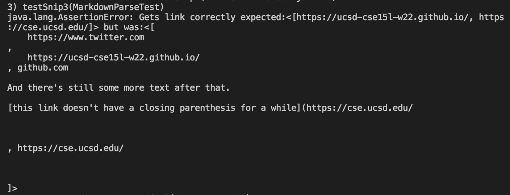

Fail including stack trace:

## Link to markdown-parse directory my group reviewed:

[https://github.com/Obarquinho/markdown-parse](https://github.com/Obarquinho/markdown-parse)

### Snippet 1 Test Details

Expected Output:

`[google.com, ucsd.edu]`

How I turned it into a test:

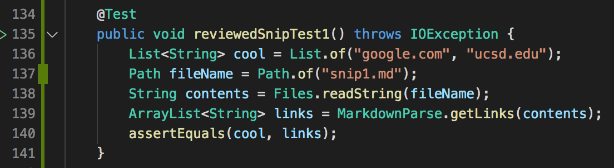

**Test did NOT pass**
Test failure in the JUnit output:

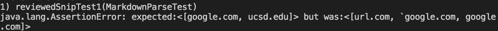

Fail including stack trace:

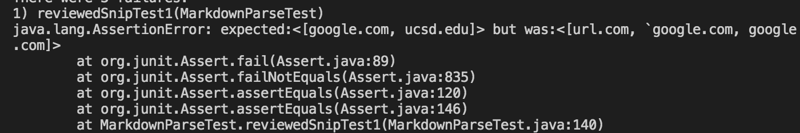

### Snippet 2 Test Details

Expected Output:

`[a.com, example.com]`

How I turned it into a test:

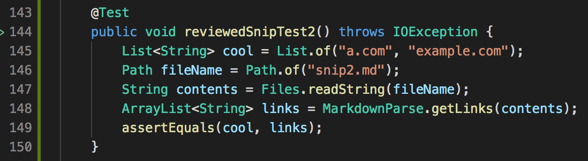

**Test did NOT pass**
Test failure in the JUnit output:

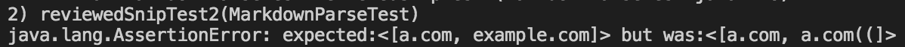

Fail including stack trace:

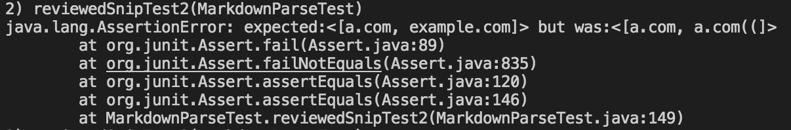

### Snippet 3 Test Details

Expected Output:

`[https://ucsd-cse15l-w22.github.io/, https://cse.ucsd.edu/]`

How I turned it into a test:

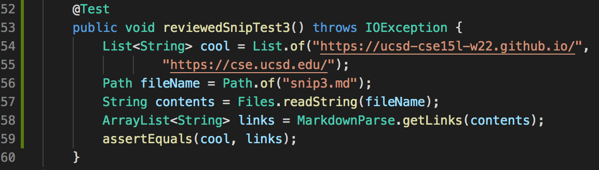

**Test did NOT pass**
Test failure in the JUnit output:

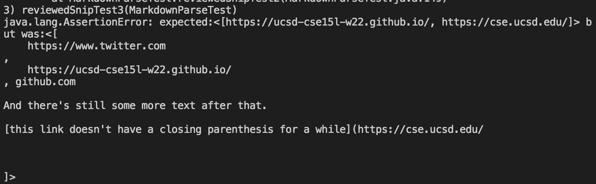

Fail including stack trace:

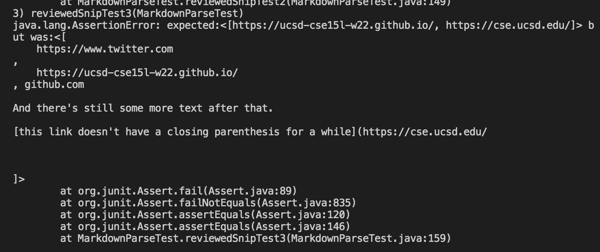

## Answers to Questions:

1. 

2. 

3. 