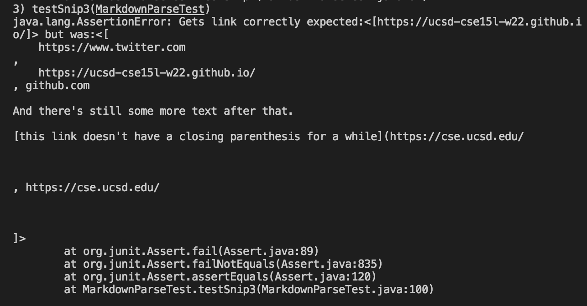

# Week 8 Lab Report - Running and Analyzing Tests for MarkdownParse

[Back to main page](index.html)

### Link to my markdown-parse directory: [https://github.com/lizazak/markdown-parse](https://github.com/lizazak/markdown-parse)

### Snippet 1 Test Details

Expected Output: [`google.com, google.com, ucsd.edu]

How I turned it into a test:

**Test did NOT pass**

Test failure in the JUnit output:

### Snippet 2 Test Details

Expected Output: [a.com, a.com(()), example.com]

How I turned it into a test:

**Test did NOT pass**

Test failure in the JUnit output:

### Snippet 3 Test Details

Expected Output: [https://ucsd-cse15l-w22.github.io/]

How I turned it into a test:

**Test did NOT pass**

Test failure in the JUnit output:

### Link to markdown-parse directory my group reviewed: [https://github.com/Obarquinho/markdown-parse](https://github.com/Obarquinho/markdown-parse)

The test details below are for the markdown-parse repository my group reviewed.

### Snippet 1 Test Details

Expected Output: [`google.com, google.com, ucsd.edu]

How I turned it into a test:

**Test did NOT pass**

Test failure in the JUnit output:

### Snippet 2 Test Details

Expected Output: [a.com, a.com(()), example.com]

How I turned it into a test:

**Test did NOT pass**

Test failure in the JUnit output:

### Snippet 3 Test Details

Expected Output: [https://ucsd-cse15l-w22.github.io/]

How I turned it into a test:

**Test did NOT pass**

Test failure in the JUnit output:

## Answers to Questions:

1. Since the backticks sort of function as parantheses themselves by making the text inside inline code, I think it would require a more involved change because it's a similar case to overlapping and nested brackets/parentheses. We would have to account for whether or not a bracket or parantheses is inside two backticks, and we'd also have to check if there are nested backticks, and which backticks are the ones responsible for turning the test into inline code. Because there are so many different variations for using backticks, from nesting, to overlapping with brackets, to just being inside the link, it will likely require more than 10 lines to fix the tests so the backticks are taken into account.

2. I believe that nested and escaped brackets/parentheses will require a more involved change, like using a stack of some sort, because we will need to keep track of which open parentheses will match to which close parentheses, and which one will correspond to which pair of open/closed brackets. We'll also need to know which pairs of brackets/parentheses to ignore because they're already nested inside brackets, so they should just function as text.

3. For the newlines case, I think it is possible to fix the issue with a small code change. First, I think we should an if-statement to check if both brackets corresponding to the link are on the same line, because that determines if it's a valid link. We also need an if-statement that checks if there if there is a full-line or more separation between the open/close parantheses and the link. Finally, when printing the links we should omit spaces on both sides in the output to make the list cleaner, and we can easily do that by using `trim()` on both sides of the String.