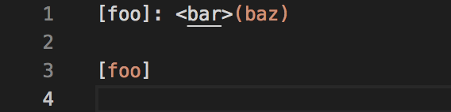
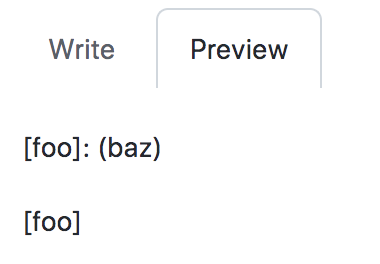
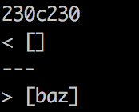
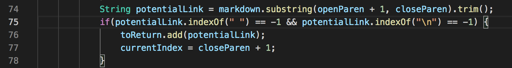
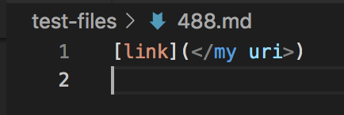
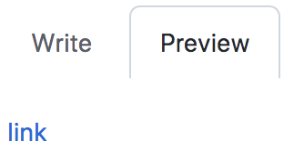
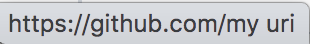
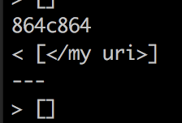
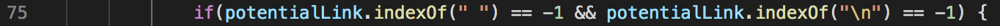

# Week 10 Lab Report - MarkdownParse Tests and their Corresponding Bugs

[Back to main page](index.html)

Below will be two tests that had different outputs for my implementation versus the provided lab 9 implementation and details regarding the corresponding bug and how to fix it.

### How the tests were found:

The tests were found by first running the `` bash script.sh > results.txt`` command two different times for each version of the MarkdownParse getLinks method (the script.sh file from the given markdown-parse repository was used and I printed the md file for each result). I then went out of both directories and used the command ``diff markdown-parse/results.txt cse15l-markdown-parse/results.txt`` to get the difference in outputs for each test file. From there, I was able to look at individual tests and figure out which tests yielded different results for the two implementations, and which implementations had bugs in them.

## Test 1

### Test 1 contents:

### Which one is correct?:

Using Github preview, the md file 201.md should not have any links.

### Preview

**Expected Output:** ``[]`` 

**Actual Outputs:**

Therefore, my implementation is correct and the provided lab 9 implementation is incorrect.

### Bug decription:

The reason the provided implementation identifies "baz" as a link is because there is no if-statement in the getLinks method that checks whether or not the closing bracket and open parentheses are adjacent. In order to fix this bug and have the implementation print an empty list, you could add a check for whether or not the "]" and ")" in the same if statement as the one below the potential link, as shown below:

## Test 2

### Test 2 contents:

### Which one is correct?:

Using Github preview, the md file 488.md should have one link "my uri".

### Preview

**Expected Output:** ``[my uri]``

**Actual Outputs:**

Based on the expected output and actual output, my output is incorrect because the link should not include the "/", "<", and ">", as shown by how the link is expected to look. The lab 9 provided implementation is also incorrect because it just had an empty list instead of one containing the correct link.

### Bug decription:

The reason the provided implementation identifies no links is because it looks at if potential links contains spaces, and if they do it does not identify it as a link. The if-statement that checks for this is below:

To fix the implementation, we could add an if-statement that checks if there is an open and closed carrot surrounding the string with a space, as well as a forward slash, and if there is then the string inside will be considered the link. Similarly with my markdown-parse getLinks implementation, I need to add an if-statement that checks if the link string contains two carrots and a forward slash, and if so it needs to trim the string to exclude those 3 characters, and just return the leftover string, in our case, "my uri".